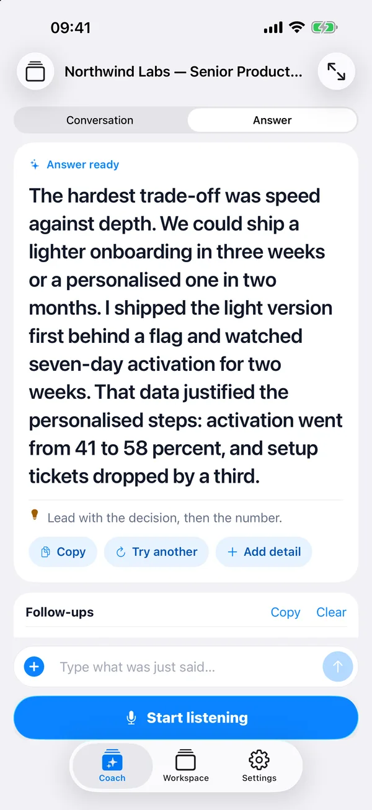

# MagicInterview — know what to say next, live


Know what to say next, even when the question catches you off guard. MagicInterview listens to your interview or meeting and shows suggested responses as the conversation happens. Add your CV and the job description, or bring a client brief and notes. Read a suggestion, adapt it, and keep the conversation moving.

## Live help when the conversation matters

**Interviewing for your next job?** Add your CV and the job description. Get live suggestions that connect your experience to the role when the interviewer asks a question.

**Finally meeting that potential client?** Bring your client brief, offer, and past notes. Get help answering questions, responding to objections, and explaining the value of your offer as the call unfolds.

**Keep your next answer in view.** Open MagicInterview on your phone beside your computer, or use it on the same computer as your call. Start listening in MagicInterview and follow the suggestions as the conversation happens.



## What the plugin connects

This plugin connects your AI assistant to your MagicInterview workspace so it can:

- Find, create, and update projects and conversations, then open the exact meeting in MagicInterview.
- Add relevant CVs, job descriptions, client briefs, and documents to your conversations.
- Keep shared project sources consistent across related meetings while preserving individual notes and history.
- Help set up today's professional meetings in time order. When your assistant has calendar or CRM access, it can use that context too.
- Request coaching and retrieve saved debug logs to investigate a session problem.

Your assistant sets up the context and opens the right conversation. Start listening in the MagicInterview app when you are ready for live suggestions.

Use the web app on your computer or phone, or the Android app. On iPhone, add MagicInterview to your Home Screen for quick access.

## Connect through your assistant

Install the plugin and sign in to your MagicInterview account when your AI assistant asks to connect. Authentication uses the standard OAuth flow; no API key needs to be copied into the plugin.

### Technical MCP endpoint

For clients configured manually, the remote Streamable HTTP endpoint is:

```text
https://magicinterview.app/mcp
```

## Suggested prompts

- I have a job interview. Use my CV and the job description to set up live help, then open that MagicInterview conversation.
- I have a meeting with a potential client. Use our brief and past notes to set up live suggestions for the call.
- Prepare today's meetings from my available calendar context and give me MagicInterview links I can open on my phone.

## Troubleshooting for connected users

If something goes wrong, ask your assistant to check the affected MagicInterview conversation and any saved debug information available in your workspace.

## Links

- [MagicInterview](https://magicinterview.app)
- [Privacy policy](https://magicinterview.app/how-it-works#privacy)
- [Terms of service](https://magicinterview.app/how-it-works#terms)
- [Support](https://magicinterview.app/how-it-works#contact)

## License

MIT
